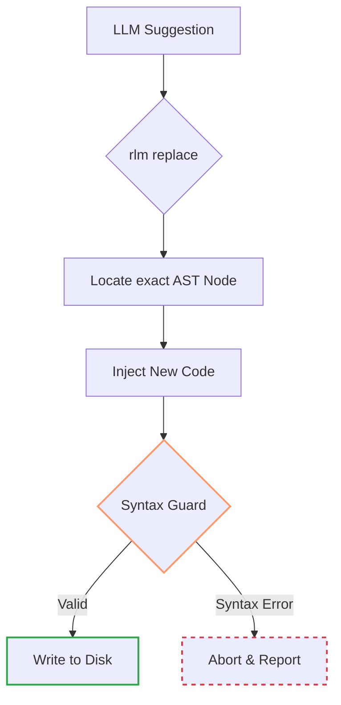

# rlm — The Context Broker

**Stop feeding entire files to your AI. Start querying your codebase.**

[](#license)
[]()

> Based on [Recursive Language Models](https://alexzhang13.github.io/blog/2025/rlm/) research (MIT/Stanford, 2025)

---

## Table of Contents
- [About This Project](#about-this-project)
- [The Problem](#the-problem)
- [The Solution](#the-solution)
- [How It Works](#how-it-works)
- [Performance](#performance)
- [Quick Start](#quick-start)
- [Setup for AI Agents](#setup-for-ai-agents)
- [Commands](#commands)
- [Contributing](#contributing)
- [License](#license)
- [Contact](#contact)
- [Acknowledgments](#acknowledgments)

## About This Project

This is a proof of concept / MVP to validate and make practical use of the ideas presented in the [Recursive Language Models](https://alexzhang13.github.io/blog/2025/rlm/) research (MIT/Stanford, 2025). The paper makes compelling claims about progressive disclosure and query-based retrieval for code understanding — this tool is my attempt to see if those ideas hold up in real-world usage. Built with Rust for memory safety and blazing fast indexing, it ensures that querying your codebase feels instantaneous and lightweight.

It's also my first public project. I'm making the source code available so you can see for yourself what's going on under the hood — no data collection, no shady business, just the code doing what it says.

Honestly, I don't know yet where this project is headed. I want to see how it's received and how people use it before deciding on the next steps. That's why I'm keeping my licensing options open for now. Maybe it'll become fully open source someday, maybe it'll stay as it is — we'll see.

Feedback is welcome. Pull requests are not, at least for now.

---

## The Problem

When AI agents work with code, they typically do this:

```
Agent: "I need to understand this codebase"
→ Reads file1.rs (500 tokens)
→ Reads file2.rs (800 tokens)
→ Reads file3.rs (600 tokens)
→ ...
→ Context window fills up
→ Earlier files get "forgotten" (Context Rot)
→ Agent makes mistakes or asks to re-read files
```

**The result:** Thousands of tokens wasted, context rot, slower responses, higher costs.

## The Solution

rlm treats your codebase like a database, not a pile of files.

```
Agent: "I need to understand this codebase"
→ rlm overview (~200 tokens) — sees project structure and purpose of each file
→ rlm refs Config (~50 tokens) — finds all usages and impact
→ rlm read src/config.rs --symbol load (~100 tokens) — reads only the relevant function
→ Done. Total: ~350 tokens instead of thousands.
```

**The principle:** Never load what you don't need. Query, don't dump.

---

## How It Works

### Progressive Disclosure

Instead of reading entire files, rlm lets you zoom in progressively:


Most tasks can be completed without ever reading a full file.

### Context as Environment Variable

Traditional approach:
```python
# Load everything into context, hope for the best
context = read("file1.rs") + read("file2.rs") + read("file3.rs")
llm.generate(context + prompt)
```

rlm approach:
```python
# Query what you need, when you need it
structure = rlm.map()           # What files exist and why?
usages = rlm.refs("Config")     # Where is Config used?
code = rlm.read("config.rs", symbol="load")  # Just this function
llm.generate(structure + usages + code + prompt)
```

The codebase stays outside the context window, queryable on demand.

### Surgical Editing

Traditional AI editing:
```
Agent: *reads 500-line file*
Agent: *rewrites entire file with one small change*
→ Risk of unintended changes
→ 1000+ tokens for input + output
```

rlm editing:
```bash
rlm replace src/lib.rs --symbol helper --code "fn helper(x: i32) -> i32 { x * 3 }"
```
- AST-based: finds the exact node to replace
- Syntax Guard: validates the change compiles before writing
- Minimal: only the changed code goes through the LLM



---

## Performance

rlm's response design produces measurable time and token savings in
three separable ways. Each is additive; agents using rlm heavily see
the three stack.

### 1. Rounds avoided

Every tool call is a full LLM round: parse the request context,
format the tool arguments, execute, parse the response. At 3–8 s per
round depending on session size, rounds are the dominant latency
cost. rlm packages the follow-up into the first response:

| Task | Manual rounds (Grep + Read + Edit) | rlm rounds | Time saved |
|---|---|---|---|
| Edit a function, verify it compiles | 4 (Grep → Read → Edit → `cargo check`) | 1 (`rlm replace` — response includes `build: { passed, errors }`) | 9–24 s |
| Look up a method's signature to call it | 2–4 (Grep → Read, repeat on wrong match) | 1 (`rlm read --metadata`) | 3–24 s |
| Find callers of a symbol (unique name) | 1–5 (Grep → Read each match) | 1 (`rlm refs`) | 3–32 s |
| Find callers of a common method (`.open()`, `.new()`, `.parse()`) | 5–15+ (each grep hit needs a Read to identify the receiver type before the list is useful) | 1 (`rlm refs Database::open` — AST-filtered to the specific symbol) | 15–120 s |
| See a symbol's body + callers + callees + type info | 4+ (Read + Grep + Read + type-lookup) | 1 (`rlm context --graph`) | 9–32 s |

The ambiguity multiplier matters most on common method names. A
codebase typically has five or more functions called `open`
(`File::open`, `Database::open`, `Connection::open`, …).
`grep "\.open\("` returns them all; the agent then has to Read each
call site to determine the receiver type before the list is useful.
`rlm refs` starts from the semantic identity and returns only the
callers of *that* specific `open` — grep-level noise eliminated by
construction.

### 2. Rework cycles avoided

A grep-based workflow over-matches (string hits that aren't semantic
refs) and under-matches (trait dispatch, re-exports, macro-generated
methods). Acting on those results costs a second cycle:
edit-based-on-wrong-info → compile error → re-investigate → fix. One
rework cycle is typically 3–5 rounds (failure → diagnosis → correction
→ retry → verify), worth **15–40 s per avoided cycle**.

rlm's AST-backed queries return exactly the semantic matches, so
edits land first-try. This isn't just a time savings — an agent
working from a noise-contaminated grep list will undercount and
overcount simultaneously, producing edits that miss some real call
sites and break unrelated code.

### 3. Tasks made tractable

Some rlm outputs resolve questions that would take 20+ rounds of
manual assembly and still produce approximations:

- Call-graphs with correct method-receiver resolution.
- Transitive impact of a symbol change through the ref graph.
- Lexical scope at a specific line (which symbols are visible).
- Which tests transitively exercise a given symbol (new in 0.5.0).

At 3–8 s per round, a 20-round manual attempt is **60–160 s**, and the
result is often still wrong enough to need a rework cycle. rlm
answers in one round with ground truth from the index — orders of
magnitude faster, not a small constant factor.

### 4. Tokens per response

TOON format (automatically configured by `rlm setup`, see
[Setup for AI Agents](#setup-for-ai-agents)) shrinks flat responses
(search, refs, files, stats) by 30–50 % versus JSON. Each saved token
reduces both the LLM's input-processing time on subsequent calls and
the prompt-cache pressure over a long session.

### Aggregate

A typical coding session with 30–80 rlm calls saves **1–3 minutes of
wall-clock latency** through class 1 alone, plus 1–2 avoided rework
cycles (class 2) worth another 30–80 s, plus any class-3 tasks that
otherwise wouldn't have been feasible at all. Numbers vary with
session size and task mix — the structural point is that the savings
compound across rounds, not just within a single response.

---

## Quick Start

### Installation

**Download pre-built binaries:**

| Platform | Download |
|----------|----------|
| Linux | [rlm-linux](https://github.com/SaschaOnTour/rlm/releases/latest) |
| macOS | [rlm-macos](https://github.com/SaschaOnTour/rlm/releases/latest) |
| Windows | [rlm-windows.exe](https://github.com/SaschaOnTour/rlm/releases/latest) |

**Or build from source:**

```bash
# Requires Rust 1.75+
cargo build --release

# Add to PATH
export PATH="$PWD/target/release:$PATH"
```

### Index Your Project

```bash
cd your-project
rlm index .
```

> **Note:** Indexing respects `.gitignore` — files and directories listed there are automatically skipped.
> Hidden files (starting with `.`) and common build directories (`node_modules/`, `target/`, etc.) are also excluded.

### Explore

```bash
# Get oriented (~200 tokens)
rlm map

# Find where something is used
rlm refs MyStruct

# Read just the function you need
rlm read src/main.rs --symbol main

# Search across the codebase
rlm search "error handling"
```

---

## Setup for AI Agents

rlm is designed to be used by AI agents, not manually. There are two ways to integrate it:

### Option A: MCP Server (Recommended)

The Model Context Protocol (MCP) gives the agent native access to rlm tools.

```bash
# Find where rlm is installed
which rlm
# Example output: /home/user/projects/rlm/target/release/rlm

# Register with Claude Code (use absolute path)
claude mcp add rlm -- /home/user/projects/rlm/target/release/rlm mcp

# Or if you just built it:
claude mcp add rlm -- "$(pwd)/target/release/rlm" mcp

# Verify it's registered
claude mcp list
```

> **Note:** Use the absolute path to the `rlm` binary. MCP servers run as separate processes and may not have access to your shell's PATH.

That's it. The agent now has direct access to all rlm commands as native tools.

**What the agent sees:** 18 MCP tools organized in 4 tiers:

| Tier | Tools | Purpose |
|------|-------|---------|
| **Orient** | `overview` (minimal/standard/tree) | Project structure at 3 zoom levels |
| **Search** | `search`, `read` (symbol/section + metadata) | Find and read code |
| **Analyze** | `refs` (with impact), `context` (with callgraph), `deps`, `scope` | Understand code |
| **Edit** | `replace`, `insert` | Modify code with Syntax Guard |
| **Utility** | `diff`, `partition`, `summarize`, `files`, `stats`, `savings`, `verify`, `supported`, `index` | Maintenance |

> **Note:** Both MCP and CLI offer the same 18-tool surface. Key consolidations: `peek`/`map`/`tree` → `overview`, `type_info`/`signature` → `read --metadata`, `callgraph` → `context --graph`, `impact` → `refs`.

### Option B: CLI via CLAUDE.md

If you prefer CLI mode, add instructions to your project's `CLAUDE.md`:

```markdown
## rlm Available

This project is indexed with rlm. Use Bash commands for efficient code exploration.

### Quick Reference
- `rlm help` — list all commands
- `rlm help <command>` — detailed help for a command

### Workflow: Start Cheap, Zoom In
1. `rlm overview --detail minimal` — structure only (~50 tokens)
2. `rlm overview` — project overview (~200 tokens)
3. `rlm refs <symbol>` — find usages + impact analysis
4. `rlm read <path> --symbol <n>` — read one function
5. Use Claude Code's Read for full files (last resort)

### Editing
- `rlm replace <path> --symbol <n> --code "<new>" --preview` — preview
- `rlm replace <path> --symbol <n> --code "<new>"` — apply

### Output Format (Minified JSON)
| Key | Meaning |
|-----|---------|
| `r` | results (array) |
| `k` | kind (fn, struct, class, enum, trait, etc.) |
| `n` | name / identifier |
| `l` | lines [start, end] or single line number |
| `c` | content (code) or count |
| `s` | symbol name |
| `f` | file path |
| `t` | token estimate `{"in": N, "out": N}` |
| `q` | quality warning — if `fallback_recommended: true`, use Claude Code's Read for affected lines |
```

### Which to Choose?

| Mode | Pros | Cons |
|------|------|------|
| **MCP** | Native integration, no prompting needed | Requires MCP support in agent |
| **CLI** | Works with any agent | Agent must be instructed via CLAUDE.md |

For Claude Code, MCP is recommended. For other agents or simpler setups, CLI works well.

---

## Commands

> **Important:** Most commands (`overview`, `search`, `refs`, etc.) only operate on
> **indexed files**. If a file wasn't indexed (unsupported extension, excluded by gitignore),
> it won't appear in results. Use `rlm files` to see all files regardless of index status.

### Orient

| Command | Use When |
|---------|----------|
| `rlm overview` | Project overview with descriptions (~200 tokens) |
| `rlm overview --detail minimal` | Quick structure check (~50 tokens) |
| `rlm overview --detail tree` | Directory hierarchy with symbol annotations |
| `rlm files` | See ALL files including those with unsupported extensions |

### Search & Read

| Command | Use When |
|---------|----------|
| `rlm search <query>` | Full-text search. AND by default (`foo bar`), `OR` explicit (`foo OR bar`), `"phrase"` for contiguous match, `prefix*` for wildcard |
| `rlm search <query> --fields minimal` | Same, but hits drop `content` — names + line ranges only, for existence / file-list queries. Saves ~5k tokens per call |
| `rlm read <path> --symbol <n>` | Read one function/struct/class |
| `rlm read <path> --symbol <n> --metadata` | Read with type info + signature |
| `rlm read <path> --section <heading>` | Read a markdown section |

**`rlm search` vs Claude Code's `Grep`** — both are fast; pick the one
that matches the question:

- Reach for **`rlm search`** when you're hunting for code symbols, documented
  intent, or content that rlm already indexed (AST-aware, skips
  `node_modules`/`target`/`.rlm` automatically). Supports AND (default),
  `OR`, `"phrase"`, and `prefix*`.
- Reach for **`Grep`** when you need regex, literal punctuation, line
  anchors, or a file rlm doesn't index (yaml, toml, build output,
  lockfiles, binaries).

### Analyze

| Command | Use When |
|---------|----------|
| `rlm refs <symbol>` | Find all usages + impact analysis |
| `rlm context <symbol>` | Full understanding: body + callers + callees |
| `rlm context <symbol> --graph` | Include full callgraph |
| `rlm deps <path>` | See file dependencies |
| `rlm scope <path> --line N` | What's visible at a location |

### Edit

| Command | Use When |
|---------|----------|
| `rlm replace <path> --symbol <n> --code "<new>"` | Replace a function/struct (inline code) |
| `rlm replace <path> --symbol <n> --parent <Foo> --code "<new>"` | Disambiguate when two symbols share the ident (e.g. `Foo::new` vs. `Bar::new`) |
| `cat patch.rs \| rlm replace <path> --symbol <n> --code-stdin` | Replace, reading code from stdin (no escape headaches) |
| `rlm replace <path> --symbol <n> --code-file patch.rs` | Replace, reading code from a file |
| `rlm replace ... --preview` | Preview the change first |
| `rlm delete <path> --symbol <n> [--parent <Foo>]` | Delete a function/struct — takes the leading doc-comment / attribute block with it |
| `rlm delete <path> --symbol <n> --keep-docs` | Delete but preserve the doc/attribute sidecar (for replace-via-delete-then-insert workflows) |
| `rlm extract <src> --symbols A,B,C --to <dest>` | Move symbols to a new or existing file atomically (docs/attrs travel along) |
| `rlm insert <path> --code "<new>" --position top` | Insert code at a position |
| `rlm insert <path> --code-stdin --position bottom` | Insert, reading code from stdin |

### Transform & Summarise

| Command | Use When |
|---------|----------|
| `rlm partition <path> --strategy <semantic\|uniform:N\|keyword:q>` | Split a file into chunks (semantic symbols, fixed line count, or keyword-anchored) |
| `rlm summarize <path>` | Condensed summary (symbols + description) |

### Utility

| Command | Use When |
|---------|----------|
| `rlm index .` | Initial indexing or full re-index |
| `rlm stats` | See index statistics |
| `rlm stats --savings` | Token savings report (vs Claude Code tools) |
| `rlm diff <path>` | Compare indexed vs current content |
| `rlm verify` | Check index integrity |
| `rlm quality` | Check for parse quality issues |
| `rlm supported` | List all supported file extensions + parser types |
| `rlm setup` | Configure Claude Code integration (settings.json + CLAUDE.local.md) |
| `rlm mcp` | Start the MCP server (stdio transport) |

---

## Output Format

All output is minified JSON to minimize token consumption:

```json
{"r":[{"id":1,"k":"fn","n":"main","l":[1,5],"c":"fn main() {...}"}],"t":{"in":0,"out":45}}
```

| Key | Meaning |
|-----|---------|
| `r` | results |
| `k` | kind (fn, struct, enum, trait, etc.) |
| `n` | name |
| `l` | lines [start, end] |
| `c` | content |
| `s` | symbol |
| `t` | token estimate `{"in": N, "out": N}` |
| `f` | file path |
| `sig` | signature |
| `dc` | doc comment (`///`, `/**`, docstrings) |
| `at` | attributes/decorators (`#[derive]`, `@Override`) |
| `q` | parse quality warning (see below) |

Example with quality warning:
```json
{"r":[...],"t":{"in":100,"out":50},"q":{"fallback_recommended":true,"el":[15,23],"m":"File has 2 parse errors. Consider using read/grep for affected lines."}}
```

---

## Parse Quality & Fallback

rlm uses tree-sitter for AST-based parsing. Tree-sitter grammars may not support the latest language features. When a file contains unsupported syntax, rlm still indexes it but marks the result with a quality warning.

### How It Works

1. During indexing, each file's parse result is checked for tree-sitter ERROR nodes
2. Files with errors get a `parse_quality` value stored in the database
3. Query responses include a `q` field when quality issues are detected

### Quality Levels

| Level | Meaning |
|-------|---------|
| `complete` | No parse errors, all AST nodes resolved correctly |
| `partial` | Some ERROR nodes found; most of the file was parsed successfully |
| `failed` | Majority of the file could not be parsed |

### Decision Tree for Agents

```
Response received
├── No "q" field → AST data is reliable, use normally
└── "q" field present
    ├── fallback_recommended: false → Minor issues, AST data mostly reliable
    └── fallback_recommended: true
        ├── For reading code → use Claude Code's Read tool
        ├── For searching → use `rlm search <query>`
        └── For refs/context → results may be incomplete
```

### Token Savings Tracking

rlm silently tracks how many tokens each operation saves compared to what Claude Code's native tools (Read/Grep/Glob) would have consumed for the same result.

```bash
# See cumulative savings report
rlm stats --savings

# Filter by date
rlm stats --savings --since "2026-03-01"
```

Example output:
```json
{"ops":42,"output":3200,"alternative":48000,"saved":44800,"pct":93.3,"by_cmd":[{"cmd":"overview","ops":12,...}]}
```

The `savings` MCP tool provides the same report for AI agents.

### Checking Quality via CLI

```bash
# See files with parse quality issues in stats
rlm stats

# Inspect detailed quality issues
rlm quality --summary      # Summary statistics
rlm quality --unknown-only # Only issues without test coverage
rlm quality --all          # All logged issues
```

---

## Supported Languages

| Language | Parser | Extensions | Chunks Extracted |
|----------|--------|------------|------------------|
| **Rust** | tree-sitter | `.rs` | fn, struct, enum, enum_variant, impl, method, mod, trait |
| **Go** | tree-sitter | `.go` | func, type, interface, struct |
| **Java** | tree-sitter | `.java` | class, interface, method, enum |
| **C#** | tree-sitter | `.cs` | class, struct, interface, method, enum |
| **Python** | tree-sitter | `.py`, `.pyi` | class, def, async def |
| **PHP** | tree-sitter | `.php` | class, function, interface, trait |
| **JavaScript** | tree-sitter | `.js`, `.jsx` | function, class, arrow, export |
| **TypeScript** | tree-sitter | `.ts` | interface, type, enum, namespace |
| **TSX** | tree-sitter | `.tsx` | JSX components + TS features |
| **HTML** | tree-sitter | `.html`, `.htm` | element IDs, script/style blocks |
| **CSS** | tree-sitter | `.css` | rules, media queries, keyframes |
| **YAML** | serde | `.yaml`, `.yml` | top-level keys, nested objects |
| **TOML** | serde | `.toml` | tables, arrays of tables |
| **JSON** | serde | `.json` | semantic keys (scripts, deps) |
| **Markdown** | structural | `.md` | headings as sections |
| **PDF** | pdf-extract | `.pdf` | pages as chunks |
| bash, sql, xml, c, cpp | plaintext | various | FTS-searchable |

---

## Integration with Other Tools

### Other AI Agents

rlm works with any agent that can execute shell commands or connect via MCP (stdio transport). See [Setup for AI Agents](#setup-for-ai-agents) for details.

### IDE Integration

rlm can complement your IDE's built-in features:

```bash
# Use rlm for cross-file analysis that IDEs struggle with
rlm refs Config           # What breaks if I change this?
rlm context main --graph  # Full call tree across modules
```

### CI/CD Pipelines

```bash
# Check for parse quality issues before merge
rlm quality --summary --exit-code

# Generate codebase overview for documentation
rlm overview > docs/architecture.json
```

---

## Benchmarks

*Coming soon: Comparative analysis of token consumption and accuracy on real-world tasks.*

Preliminary results suggest 60-80% token reduction on typical code exploration tasks, with improved accuracy due to reduced context rot.

---

## The Research

rlm is inspired by the [Recursive Language Models](https://alexzhang13.github.io/blog/2025/rlm/) paper (MIT/Stanford, 2025), which demonstrated that:

1. **Progressive disclosure** beats full-context loading for code understanding
2. **AST-aware chunking** preserves semantic boundaries better than line-based splits
3. **Query-based retrieval** reduces context pollution and improves task accuracy

We've adapted these principles into a practical tool for everyday use with AI coding assistants.

---

## Roadmap

- [x] Core indexing and search
- [x] AST-based code intelligence (refs with impact, context with callgraph)
- [x] Surgical editing with Syntax Guard
- [x] MCP server integration
- [x] Parse quality detection and fallback recommendations
- [x] Configuration file support
- [x] Extended language support (JS, TS, HTML, CSS, YAML, TOML, JSON)
- [x] Test Impact analysis — write responses name covering tests + command (0.5.0)
- [x] Native compiler check post-write (`cargo check` surfaces name-resolution / type errors that Syntax Guard can't see — 0.5.0)
- [x] `rlm extract` — atomic module-split primitive (0.5.0)
- [x] `--parent` disambiguation for same-ident symbols (0.5.0)
- [x] TOON output default for agent-scoped projects (0.5.0)
- [ ] Native compiler check for Go / TypeScript / Python
- [ ] Automatic import-inference on `rlm extract`
- [ ] Benchmark suite with published results
- [ ] Language Server Protocol (LSP) integration
- [ ] Web UI for visualization
- [ ] More languages (C++, Ruby, Kotlin)

---

## Philosophy

rlm is part of a larger vision: making powerful tools accessible to everyone, not just experts.

The same principle applies to AI coding assistants: they shouldn't require you to understand tokenization, context windows, or prompt engineering. They should just work efficiently.

> *"The best interface is no interface."* — Golden Krishna

---

## Contributing

This project is currently a solo-run exploration. While I am grateful for the interest, **I am not accepting Pull Requests at this time.**

- **Have a bug or idea?** Please [open an Issue](https://github.com/SaschaOnTour/rlm/issues). I value your feedback!
- **Want to contribute code?** Not yet, but feel free to "Star" the project to show your support.

This approach helps me maintain the architectural integrity while the project is in its early MVP stage.

---

## License

This project uses a **Source Available License**.

You are free to use the software (including binaries) and inspect the source code. However, modification, redistribution, and creating derivative works are not permitted.

See [LICENSE](LICENSE) for the full terms.

---

## Contact

[](https://t.me/Sascha_On_Tour)
[](https://discord.com/users/921029832358387722)

---

## Acknowledgments

- [Recursive Language Models](https://alexzhang13.github.io/blog/2025/rlm/) research (MIT/Stanford)
- [tree-sitter](https://tree-sitter.github.io/) for robust parsing
- The Rust community for excellent tooling
